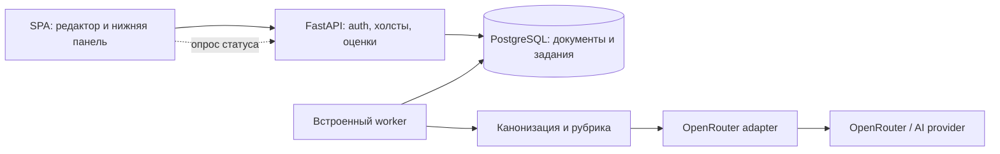

# sysdes — стек и архитектура

Статус: Baseline 1.0. Базовый стек принят по 20A, React Flow/Zustand — по 21A, cookie-аутентификация — по 22A; численные параметры — по 26A. Совместимые версии зависимостей фиксируются lock-файлами на этапе реализации; прототип и измерения не выполнены.

## Стек первой версии

| Часть | Решение | Причина и ограничение |
|---|---|---|
| SPA | React, TypeScript, Vite | Редактор работает в браузере; SSR не требуется для личных холстов |
| Холст | React Flow (`@xyflow/react`), свои узлы и связи | Типизированные блоки, формы и точки соединения; Sequence требует собственной модели и поведения |
| Состояние | Zustand для документа и undo/redo; TanStack Query для запросов | Серверные списки/статусы не смешиваются с незаписанным состоянием редактора; история команд реализуется приложением |
| UI | CSS + небольшой набор доступных компонентов, например Radix UI | Контроль полей, клавиатуры и панели свойств; итоговый набор выбрать по прототипу |
| API | Python, FastAPI, Pydantic, Uvicorn | Подтверждённый backend; строгая валидация входа и ответа |
| БД | PostgreSQL; SQLAlchemy async; Alembic | Транзакции, уникальность, версии, JSONB-документы и состояния job |
| Драйвер | psycopg 3 с async API | Один драйвер для PostgreSQL; не смешивать два драйвера без необходимости |
| OpenRouter | HTTPX AsyncClient, server-side adapter | Нужен ограниченный HTTP-вызов, а не агентная платформа |
| Задания | Таблица PostgreSQL + встроенный async worker | Состояние переживает рестарт; один процесс приложения в MVP |
| Проверки | pytest, Vitest, Playwright; проверка контрактов в CI | Семантика, интеграция с реальной БД и действия редактора |
| Проверка отзывчивости | Профилировщик браузера и локальные Performance marks в dev/test при необходимости | Малые технические проверки по 09; серверный сбор и продуктовая аналитика отложены |
| Деплой | Docker Compose: proxy/SPA + app + postgres | По 20A reverse proxy раздаёт собранную SPA и направляет /api/v1 в один процесс API; Node.js не нужен в runtime |

Точные версии Python, Node для сборки и библиотек фиксируются lock-файлами при baseline зависимостей. Предварительно выбирать поддерживаемые стабильные версии и проверять совместимость; тег `latest` в production не использовать.

React Flow позволяет создавать собственные React-компоненты узлов с формами и несколькими handles; основная библиотека распространяется по MIT. Это подтверждает пригодность механизма расширения, но не готовность всех функций редактора. [Custom Nodes](https://reactflow.dev/learn/customization/custom-nodes), [React Flow Pro / лицензия библиотеки](https://reactflow.dev/pro).

## Варианты редактора

| Вариант | Подходит для | Цена реализации / риск | Смена после MVP |
|---|---|---|---|
| **A. React Flow + семантическая модель sysdes** | HLD, ER с полями, управляемые связи; единый холст | Собственная логика Sequence, подписей, undo/redo; UX надо проверить прототипом | Средняя при независимой модели, высокая при сохранении внутренних типов библиотеки |
| B. Встроенный Excalidraw + слой семантики | Быстрый свободный редактор, готовые действия доски | Семантические ограничения и ER/Sequence придётся добавлять поверх свободного рисунка; сложнее держать рисунок и смысл согласованными | Средняя/высокая |
| C. tldraw SDK + custom shapes | Если свободное перемещение и ощущение whiteboard важнее контролируемых схем | Дополнительная предметная логика; production требует подходящей лицензии SDK | Высокая для UI, ниже для независимых документов |

Excalidraw предоставляет встраиваемый редактор и входные `elements/appState`; вывод о сложности смыслового слоя — архитектурная оценка, не заявленное ограничение API. [Исходный проект](https://github.com/excalidraw/excalidraw), [initialData](https://docs.excalidraw.com/docs/@excalidraw/excalidraw/api/props/initialdata).

tldraw требует production license key; условия необходимо сверить перед выбором и распространением приложения. В базовую рекомендацию не включён. [Лицензирование SDK](https://tldraw.dev/community/license).

Собственный движок на Canvas/Konva увеличит объём работ по текстовому вводу, выделению, привязкам и доступности; исходные требования пока не дают причины брать эту работу. React Flow принят по 21A: решение нужно пересмотреть, если прототип Sequence или внешних подписей не пройдёт сценарии AC-04/05.

## Альтернативы backend

| Вариант | Преимущество | Цена | Вывод |
|---|---|---|---|
| **FastAPI / Python** | Предпочтение пользователя, типизированная валидация, удобные эксперименты с рубриками | Нужно ограничивать фоновые задачи, память и поток проверки паролей | Рекомендуется с учётом ответа пользователя |
| Go + HTTP API | Простой compiled runtime; можно включить статику в executable | Другой язык, отдельная проверка контрактов с frontend | Резерв, если измеренный ресурсный бюджет окажется критичным |
| TypeScript + Fastify | Один язык frontend/backend; валидация JSON Schema | Runtime Node.js, другая серверная экосистема | Резерв, если важнее единый язык команды |

Сравнение ресурсов качественное: бенчмарка нет. Go поддерживает встраивание статики, Fastify — schema-based validation; это не доказывает превосходство по времени разработки или RSS в sysdes. [Go embed](https://go.dev/doc/go1.16#library), [Fastify validation](https://fastify.dev/docs/latest/Reference/Validation-and-Serialization/).

## Компоненты и границы



Worker, канонизация и адаптер — модули одного app-процесса. Стрелки показывают поток данных, не правило импортов. Redis, Celery, микросервисы, Kafka, vector DB, RAG и отдельный AI-агент не нужны для заявленного MVP.

| Модуль | Ответственность | Источник истины / зависимости |
|---|---|---|
| identity | Регистрация, сессии, проверка владельца | users, auth_sessions; хеширование и HTTP снаружи политики |
| solutions | Валидация документа, revisions, создание по шаблону | solution.document; не импортирует типы React Flow |
| catalog | Домены, неизменяемые версии шаблонов | domains, template_versions |
| evaluation | Снимки, рубрики, состояния запусков, проверка ссылок | evaluations; provider adapter за интерфейсом |
| editor (frontend) | Команды изменения, отображение, dirty-state; ручной и минутный автоматический save через общий координатор | Текущий документ, неизменяемый снимок запроса, локальные generations и подтверждённый серверный revision |
| infrastructure | SQLAlchemy, HTTPX, логирование, конфигурация, worker lifecycle | Реализует порты прикладных модулей |

Отдельный модуль telemetry, его API и таблицы не входят в архитектуру MVP. Вариант их добавления сохранён в [10-observability-next.md](10-observability-next.md) для будущей итерации; наличие этой спецификации не требует сейчас кода/инфраструктуры аналитики.

Один документ с `semantic` и `layout` сохраняется одной транзакцией. Не создавать две независимо обновляемые копии смысла: React Flow nodes/edges — производное представление. Сервер повторно валидирует и канонизирует данные, не доверяя frontend.

Ручное и автоматическое сохранение имеют отдельные триггеры/индикаторы и не блокируют редактор. Один клиентский координатор последовательно выполняет записи холста через существующий PUT с If-Match; один interval проверяет изменения каждые 60 секунд и перезапускается после подтверждения записи. Правила снимков и обработки новых правок — в [11-canvas-saving.md](11-canvas-saving.md); отдельная инфраструктура фонового сохранения не нужна.

Input Isolation: небольшой TextEditor внутри CustomNode хранит draft в локальном useState; граф меняется по text.commit на blur / Enter или через пакетный flush перед сохраняемым снимком. Технический счётчик правок обновляется через ref, индикатор dirty подписан отдельно. Узкие подписки, мемоизация и сохранение ссылок неизменившихся объектов ограничивают перерисовки. Правила и рассмотренные варианты — в [12-input-isolation.md](12-input-isolation.md); соответствие проверяется профилем ввода на стандартной сцене.

PostgreSQL JSONB подходит для хранения версионированного документа; не требуется раскладывать каждый прямоугольник по строкам. Метаданные, пользователи, шаблоны и job остаются реляционными. [PostgreSQL JSON Types](https://www.postgresql.org/docs/current/datatype-json.html).

## Развёртывание

1. Build-stage frontend формирует статические ресурсы для proxy/SPA-образа; Python app runtime содержит серверные зависимости. Node.js и toolchain остаются только на стадии сборки.
2. Runtime — slim-образ, non-root, один Uvicorn worker, без dev-reload и сборочных инструментов.
3. `proxy` раздаёт SPA и проксирует `/api/v1` в `app` с одного origin. SPA fallback не перехватывает неизвестные `/api`-маршруты; неизвестный API-путь возвращает API-ошибку, а не index.html.
4. `postgres` хранит данные в persistent volume и не публикует порт в Интернет.
5. Для внешнего доступа TLS обеспечивает reverse proxy выбранного Compose-развёртывания; локальная разработка допускает HTTP на localhost.
6. Миграции выполняются отдельной одноразовой командой того же образа перед запуском; ошибка миграции останавливает обновление.
7. API-key передаётся через Docker secret / файл секрета вне Git; переменные с ключами не попадают в SPA bundle.

По 20A один API-процесс содержит async worker: одновременно до двух AI-job, очередь до десяти и ожидание до пяти секунд в общем deadline 60 секунд; на пользователя не более одного queued/running job. Один процесс снижает начальную сложность. При переходе к нескольким app-репликам worker можно выделить тем же образом в отдельную роль. Это потребует перепроверки глобальных лимитов и recovery, а не только изменения `workers`.

FastAPI поддерживает собственный Docker-образ; для sysdes важен явный контроль числа процессов. SQLAlchemy AsyncSession нельзя разделять между конкурентными задачами — отдельная сессия БД на обработку каждого запроса/job. [FastAPI Docker](https://fastapi.tiangolo.com/deployment/docker/), [SQLAlchemy asyncio](https://docs.sqlalchemy.org/en/20/orm/extensions/asyncio.html).

## Проверка архитектурных решений

Это базовые ожидания к будущей реализации, а не аудит существующего кода.

```text
BASELINE | solutions | expected: чистая модель + use cases, UI/БД через адаптеры | observed: описан независимый документ; кода нет | fit: partial | patterns: [P-ENT, P-UC, P-ADP] | violations: [] | suggestion: проверить round-trip документа
BASELINE | evaluation | expected: снимок и рубрика не зависят от провайдера | observed: выделен provider adapter; кода нет | fit: partial | patterns: [P-UC, P-PORT, P-ADP] | violations: [] | suggestion: проверить результат против snapshot IDs
BASELINE | identity | expected: серверная политика доступа владельца | observed: предусмотрены auth sessions и проверки API; кода нет | fit: partial | patterns: [P-UC, P-CTRL] | violations: [] | suggestion: проверить изоляцию двух пользователей
```

## Общий выбор холста аккаунта

По 10C/25A currentSolutionId хранится на уровне аккаунта с отдельной selectionRevision. В активной видимой вкладке выполняется polling каждые 5 секунд и при входе/возврате фокуса/сети. Это синхронизация выбора, без передачи операций рисования. Dirty-черновики защищаются по [11-canvas-saving.md](11-canvas-saving.md).
